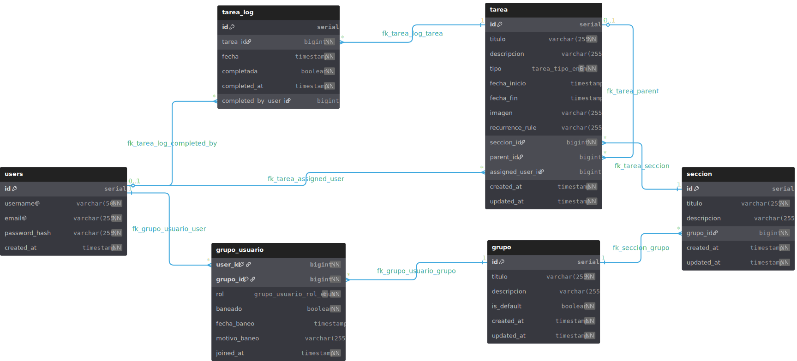

# Base de datos

## Introducción

UndertakeIt utiliza MySQL como sistema gestor de bases de datos relacional. La base de datos ha sido diseñada para gestionar usuarios, grupos de trabajo, secciones, tareas y el registro histórico de completado de tareas.

Además, la estructura permite futuras ampliaciones gracias a la inclusión de relaciones y campos preparados para funcionalidades más avanzadas.

---

## Diagrama entidad-relación

---

## Entidades principales

### Usuarios

La entidad `users` almacena la información de los usuarios registrados en la aplicación, incluyendo sus credenciales de acceso y datos básicos de identificación.

### Grupos

La entidad `grupo` permite organizar a los usuarios en espacios colaborativos donde compartir y gestionar tareas de forma conjunta.

### Miembros de grupo

La entidad `grupo_usuario` gestiona la relación entre usuarios y grupos.

Cada usuario puede pertenecer a varios grupos y cada grupo puede contener múltiples usuarios. Además, esta entidad incorpora un sistema de roles para gestionar permisos:

* Owner
* Admin
* Editor
* Lector

También permite registrar bloqueos de usuarios dentro de un grupo.

### Secciones

La entidad `seccion` permite dividir un grupo en diferentes áreas organizativas para clasificar mejor las tareas.

### Tareas

La entidad `tarea` constituye el núcleo principal de la aplicación.

Cada tarea almacena información como:

* Título.
* Descripción.
* Fechas de inicio y finalización.
* Imagen asociada.
* Usuario asignado.
* Tipo de tarea.

Actualmente existen dos tipos de tarea definidos en la base de datos:

* Puntual.
* Hábito.

La estructura también incorpora soporte para tareas jerárquicas mediante una referencia a otra tarea (`parent_id`), aunque esta funcionalidad no se encuentra implementada en la interfaz actual.

### Registro de tareas

La entidad `tarea_log` almacena el historial de completado de las tareas, permitiendo registrar cuándo fueron completadas y por qué usuario.

---

## Relaciones principales

Las relaciones más importantes del sistema son:

* Un usuario puede pertenecer a múltiples grupos.
* Un grupo puede contener múltiples usuarios.
* Un grupo puede contener múltiples secciones.
* Una sección puede contener múltiples tareas.
* Una tarea puede estar asignada a un usuario.
* Una tarea puede contener subtareas mediante autorreferencia.
* Una tarea puede generar múltiples registros en el historial de completado.

---

## Funcionalidades preparadas para futuras ampliaciones

Durante el diseño de la base de datos se incorporaron elementos destinados a futuras funcionalidades que no se encuentran implementadas en esta versión del proyecto.

Entre ellas destacan:

* Sistema de hábitos mediante el tipo de tarea `habito`.
* Reglas de recurrencia para tareas repetitivas.
* Subtareas mediante relaciones padre-hijo.
* Integración con futuras vistas de calendario basadas en fechas de inicio y finalización.
