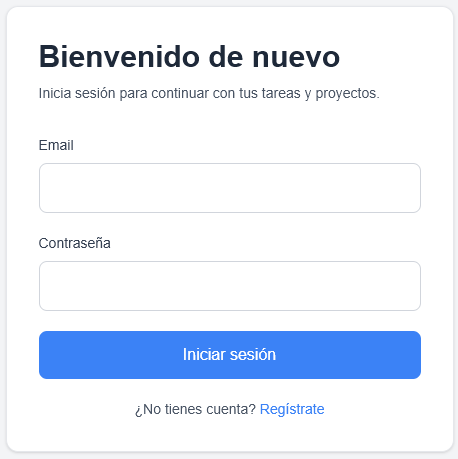
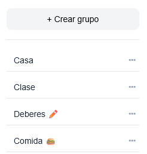
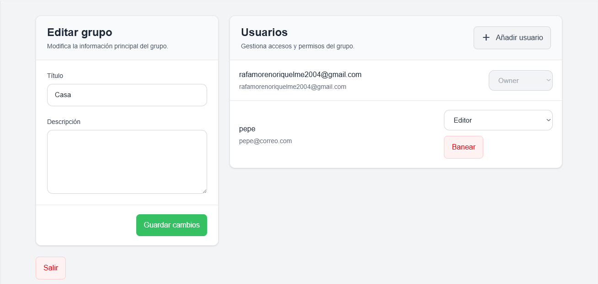
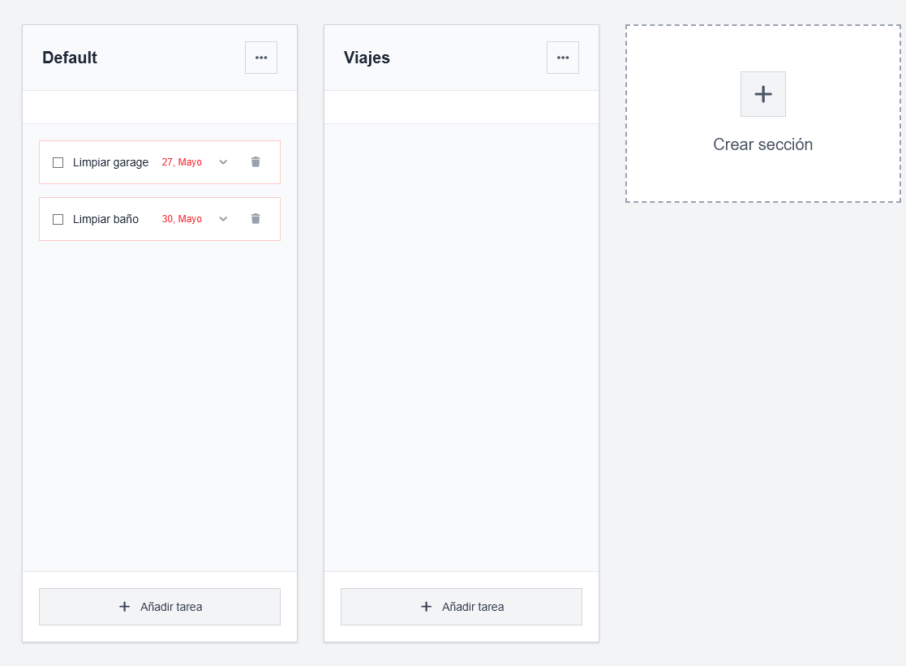
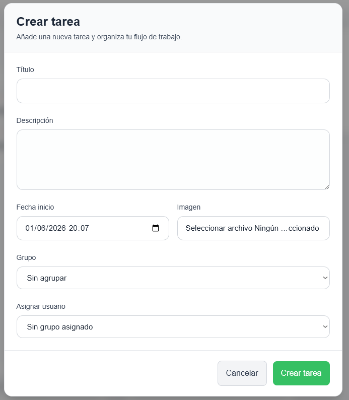
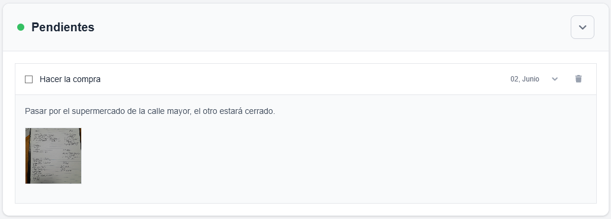
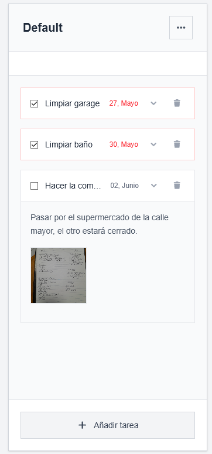
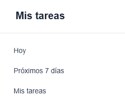
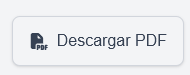

# Funcionalidades

## Gestión de usuarios

La aplicación permite a los usuarios crear una cuenta y acceder a sus espacios de trabajo mediante un sistema de autenticación.

Funcionalidades disponibles:

* Registro de usuarios.
* Inicio de sesión.
* Cierre de sesión.

---

## Gestión de grupos

UndertakeIt incorpora un sistema de grupos que permite organizar usuarios dentro de espacios colaborativos.

Funcionalidades disponibles:

* Creación de grupos.
* Eliminación de grupos.
* Acceso a grupos compartidos
* Gestión de miembros.
* Sistema de roles.

Los roles disponibles son:

* Owner
* Admin
* Editor
* Lector

Cada rol dispone de distintos permisos dentro del grupo.

---

## Gestión de secciones

Los grupos pueden dividirse en diferentes secciones para organizar mejor las tareas.

Funcionalidades disponibles:

* Creación de secciones.
* Modificación de secciones.
* Eliminación de secciones.

---

## Gestión de tareas

La gestión de tareas constituye la funcionalidad principal de la aplicación.

Funcionalidades disponibles:

* Creación de tareas.
* Edición de tareas.
* Eliminación de tareas.
* Asignación de usuarios.
* Establecimiento de fechas.
* Inclusión de descripciones.
* Marcado de tareas como completadas.

---

## Adjuntos

Las tareas pueden incluir archivos visuales para complementar la información almacenada.

Funcionalidades disponibles:

* Subida de imágenes.
* Visualización de imágenes asociadas a tareas.
* Eliminación de imágenes.

---

## Registro de actividad

La aplicación registra el historial de completado de las tareas.

Funcionalidades disponibles:

* Registro de tareas completadas.
* Filtrado por tareas de hoy, próximos 7 días y todas.

---

## Exportación a PDF

UndertakeIt permite generar documentos PDF a partir de la información almacenada en la aplicación.

Esta funcionalidad facilita la impresión o el intercambio de información fuera de la plataforma.

