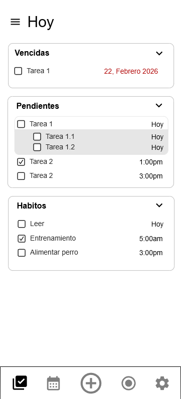
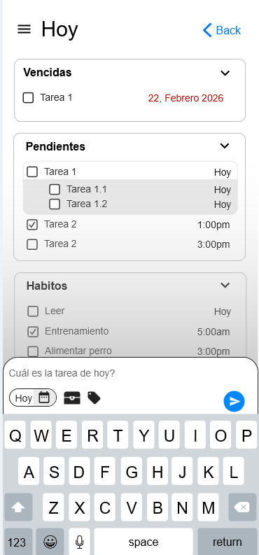
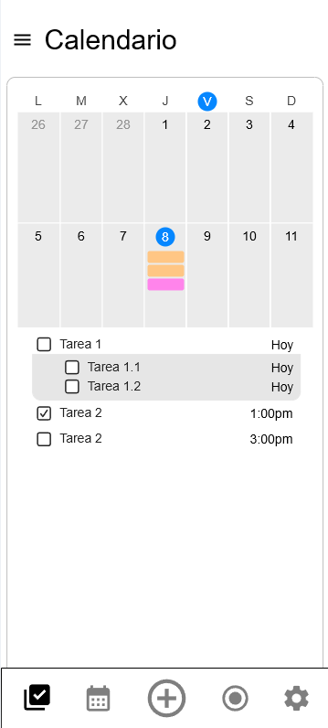
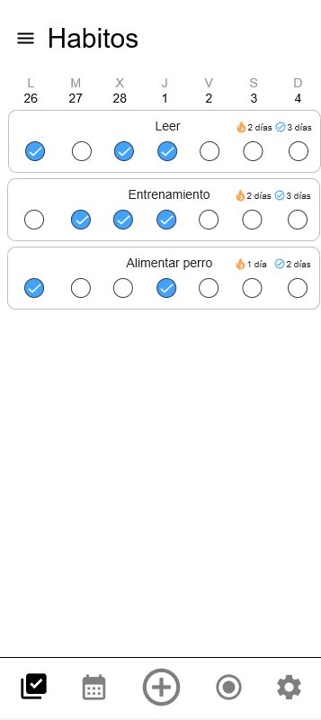
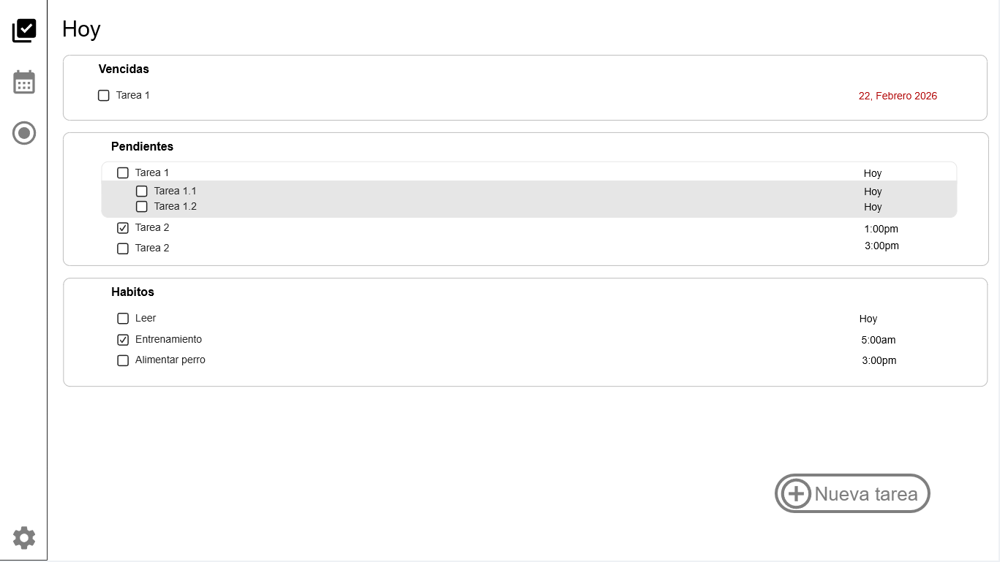
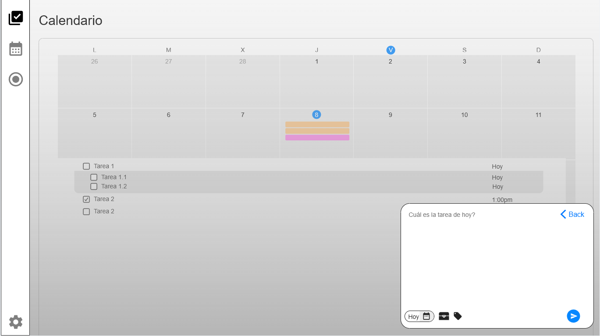
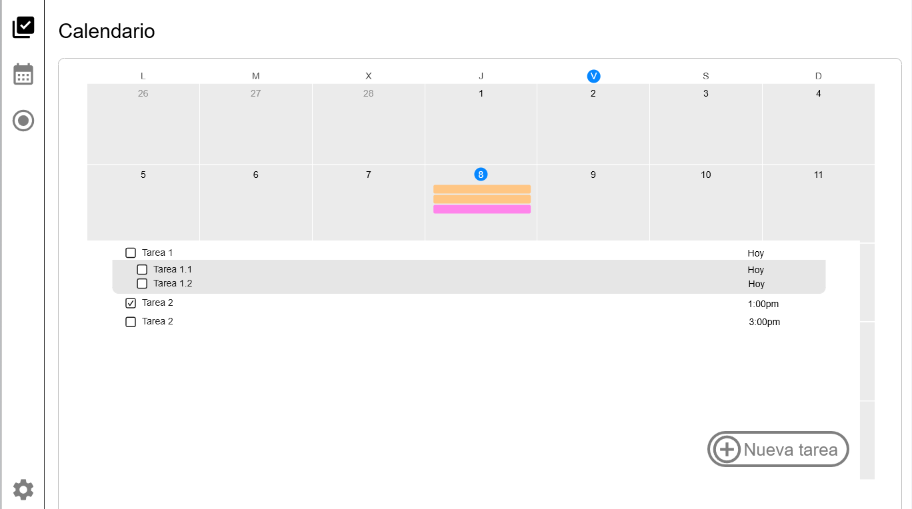
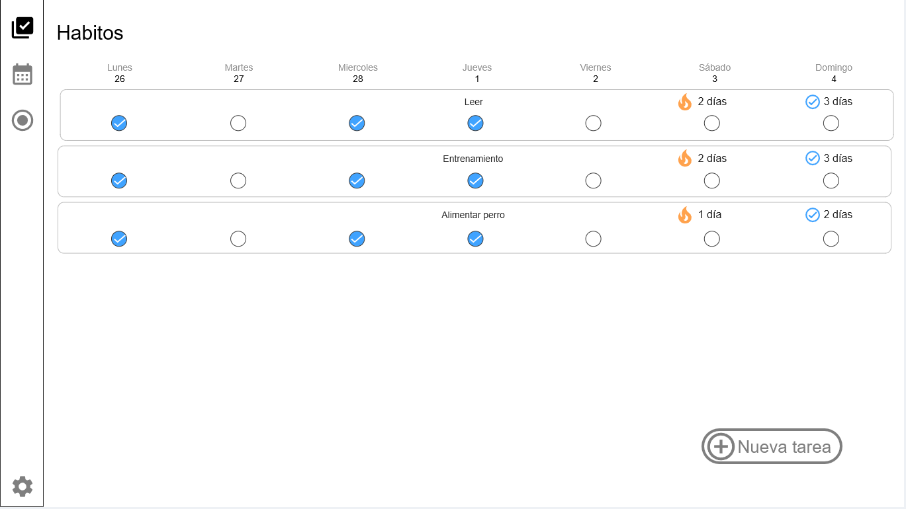

# Prototipos y Diseño de Interfaces

En esta sección se detalla la evolución del diseño de la interfaz de usuario para **UndertakeIt**, contrastando la planificación inicial con el resultado y las adaptaciones funcionales reales implementadas durante la fase de desarrollo.

Puedes acceder al espacio de trabajo interactivo original a través del siguiente enlace:

* [Enlace a los Mockups Originales en Moqups](https://app.moqups.com/R0NHQxaI3NlOx2ydSfcWZlKAYFG0SO4f/view/page/a98a4a746)

---

## 1. Diseños Originales de la Aplicación

A continuación se muestran las capturas de pantalla de la propuesta inicial de diseño, organizadas tanto para dispositivos móviles como para pantallas de escritorio (PC).

### Vista Móvil (Mobile)

* **Vista Diaria (Today):** 
* **Creación de Tareas:** 
* 
* 
* 
* 
* 
* 
* **Calendario Mensual:** 
* **Módulo de Hábitos:** 

### Vista de Escritorio (PC)

* **Vista Diaria (Today):** 
* **Creación de Tareas:** 
* **Calendario Mensual:** 
* **Módulo de Hábitos:** 

---

## 2. Control de Cambios y Evolución del Proyecto

El planteamiento visual plasmado en los mockups iniciales aportó una **excelente base y una idea estructural muy sólida** para definir la experiencia de usuario y la navegación global de la aplicación. Sin embargo, durante el ciclo de desarrollo del software se debieron priorizar y adaptar ciertos módulos debido a los requerimientos técnicos y los tiempos de entrega.

### Funcionalidades Descartadas u Postergadas

* **Calendario y Hábitos:** A pesar de tener un diseño estructural robusto y definido en los prototipos, finalmente **no se han podido desarrollar** las secciones de calendario extendido ni el módulo de seguimiento de hábitos para la versión actual del proyecto final.

### Funcionalidades Nuevas e Implementadas

* **Módulo de Grupos y Secciones:** Como contrapartida se diseñó e incorporó un sistema completo de **grupos de trabajo con sus respectivas secciones internas**. Esta característica no se había planteado originalmente en la fase de diseño inicial, pero se consideró clave para el desarrollo y **sí se llevó a cabo con éxito** en la aplicación definitiva.
